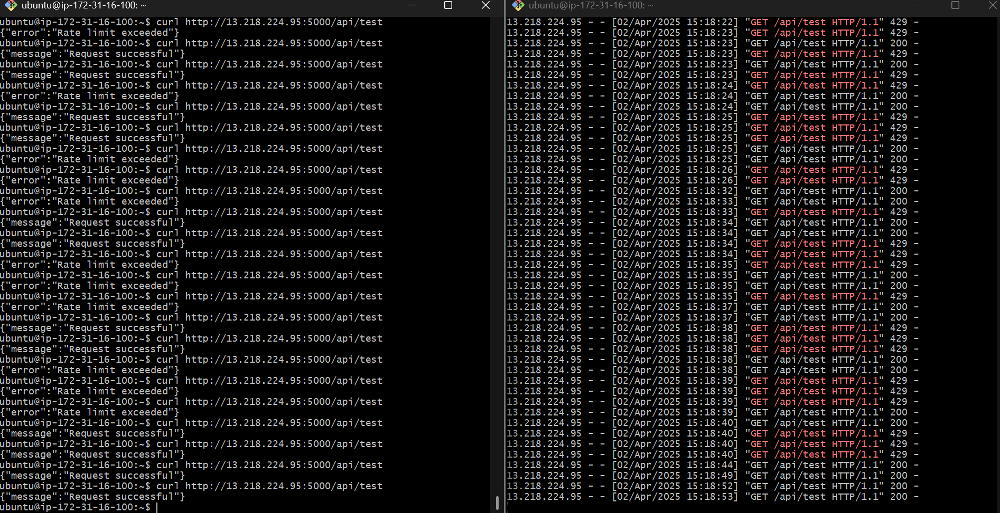

# 🚦 Fixed Window Rate Limiter
## 📘 Overview

This project demonstrates the implementation and deployment of a **Fixed Window Rate Limiter** using Python Flask, Docker, and Kubernetes on an AWS EC2 instance. The service is publicly accessible using a Kubernetes NodePort.

---

## ✅ Steps Performed

1. **Python Code Creation**
   - Implemented a **Fixed Window Rate Limiter** using Python Flask.
   - Chosen for its simplicity and ease of observing rate-limiting behavior.

2. **EC2 Instance Setup**
   - Launched an EC2 instance (Ubuntu) on AWS.
   - Transferred the Python code to the EC2 environment.

3. **Dockerization**
   - Created a `Dockerfile` to containerize the Flask app.
   - Added `requirements.txt` with necessary packages (Flask).

4. **Docker Build & Push**
   - Built the Docker image:
   - Tagged and pushed the image to DockerHub:

5. **Docker Run for Local Testing**
   - Ran the Docker container locally on EC2 to validate functionality.

6. **Kubernetes Deployment**
   - Created a Kubernetes manifest (`rate_limiter.yaml`) to deploy the Docker image as a pod.

7. **Exposed Service via NodePort**
   - Used `NodePort` to expose the service publicly through EC2's IP address.

8. **Functionality Testing**
   - Verified the working of the rate limiter by making multiple requests.
   - Attached screenshot as evidence of rate-limiting in action.

---

## 📂 Files Included

- `app.py` – Flask application with Fixed Window Rate Limiter
- `Dockerfile` – Docker instructions to containerize the app
- `requirements.txt` – Python dependencies
- `rate_limiter.yaml` – Kubernetes Deployment and Service (NodePort)
- `README.md` – Project documentation

---

## 💻 How to Test

Use `curl` or a browser to access the endpoint:

